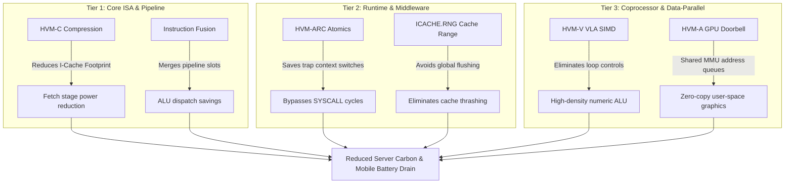

# HVM Green Compute & Performance Enhancement Proposal

This proposal details architectural extensions for the **Hoo Virtual Machine (HVM)** instruction set and runtime model. The enhancements target **lowering server carbon footprints**, **extending mobile battery life**, and **maximizing desktop throughput**—all while preserving the core RISC-based silicon design and LLVM JIT VM compatibility.

---

## 1. Executive Summary

Silicon power consumption ($P$) in modern CPUs is dominated by two factors: **instruction fetch/decode overhead** and **memory hierarchy traffic**. 

$$P = C \cdot V_{dd}^2 \cdot f + I_{leak} \cdot V_{dd}$$

By reducing dynamic instruction count, shrinking instruction cache footprints, and introducing hardware-assisted reference management, we can significantly reduce CPU clock frequencies ($f$) and memory traffic capacity ($C$), leading to massive carbon and power reductions.



---

# Part I: System & Hardware Architecture

## 2. Core ISA & Pipeline Optimizations

### 2.1 HVM-C: 16-Bit Compressed Opcodes
Instruction fetch from the L1 Instruction Cache consumes up to **35% of total CPU core power**. With HVM's 64-bit `escape32` format, code size can expand, causing instruction cache misses and higher memory energy draw.

#### The Specification
We introduce **HVM-C**, a compressed instruction extension mapping common 32-bit instructions to 16-bit equivalents when registers lie within `r0..r15` and immediates are small:

```
Base Format (32-bit):
+-----------+-------+-------+-------+---------------------+
| Opcode[7] | rd[5] | rs1[5]| rs2[5]| Func[10]            |
+-----------+-------+-------+-------+---------------------+

Compressed Format (16-bit):
+-----------+-------+-------+-------+
| Opcode[4] | rd[4] | rs1[4]| imm[4]|
+-----------+-------+-------+-------+
```

* **Dynamic Code Density**: Reduces bytecode footprint by **30–40%**.
* **Fetch Power Reduction**: Fetching 16 bits instead of 32/64 bits cuts the dynamic power of the fetch pipeline stage in half.
* **JIT VM Compatibility**: The JIT compiler can simply continue to emit standard 32-bit instructions (which remain fully valid) while resource-constrained hardware or target-optimized JITs compile to 16-bit compressed boundaries.

---

### 2.2 Instruction Fusion & Micro-Op Alignment
Modern high-performance CPUs translate RISC instructions into internal micro-ops ($\mu\text{ops}$). Certain instructions frequently occur in sequence and can be merged at the decode stage.

#### Fused Patterns
We define normative **Instruction Fusion Pairs** that the HVM hardware decoder must merge into a single execution slot:

1. **Compare and Branch**:
   ```assembly
   # Before Fusion
   CMPEQ  r9, r2, r3     # Compare r2 and r3, write boolean to r9
   BNE    r9, r0, label  # Branch if r9 is not zero

   # Fused Operation
   BEQ    r2, r3, label  # Merged execution (bypasses writing to r9)
   ```
2. **Address Scaling & Loads (Scale + Add + Load)**:
   ```assembly
   # Before Fusion
   SHL    r9, r2, 3      # Scale index by 8 (pointer size)
   ADD    r9, r9, r3     # Add array base address
   LD.D   r1, r9, 0      # Load value from memory

   # Fused Operation
   LD.D   r1, [r3 + r2 << 3] # Merged indexed load micro-op
   ```

#### JIT Alignment Rule
The HVM JIT compiler and `hoo` code generator will be updated to output these instructions consecutively, avoiding temporary register reuse between the pair. This ensures hardware decoders achieve maximum fusion rates without requiring complex out-of-order execution logic.

---

### 2.3 HVM-L: Zero-Overhead Hardware Loops
Many Hoo runtime loops are short, hot, and predictable: byte scanning, reference-table walking, bounds-checked array iteration, DSP filters, robotics control loops, and memory initialization. A conventional branch-based loop repeatedly fetches, decodes, predicts, and retires loop-control instructions even when the loop body itself is small.

HVM-L introduces a minimal hardware loop facility for profile-selected cores:

* **`LOOP.SET rs_count, imm_backedge`**
  - Loads a per-core loop counter from `rs_count`.
  - Records a signed backward branch displacement for the loop body.
  - Does not branch by itself.
* **`LOOP.DECBR label`**
  - Decrements the active loop counter.
  - Branches to `label` while the counter is nonzero.
  - Retires as a bounded loop-control operation with predictable timing.

Implementation requirements:

- The loop counter is architectural only while a loop is active; traps must save enough state to resume correctly.
- Nested hardware loops are optional. First silicon may support only one active hardware loop per core.
- `HVM-R1` real-time cores may require a bounded-latency single-loop implementation and reject nested or variable-latency forms.
- The interpreter and LLVM JIT may lower HVM-L to ordinary counted branches while preserving behavior.

Why it helps:

- Reduces fetch/decode activity in tight loops.
- Improves branch predictor energy and avoids repeated predictor updates for simple counted loops.
- Gives robotics and mobile profiles predictable low-power loop execution without requiring a wide out-of-order core.

---

### 2.4 HVM-MEM: Pair Loads, Pair Stores, and Memory Hints
Memory traffic is often more expensive than arithmetic. HVM should add small memory-oriented instructions that reduce instruction count without forcing a complex CISC memory model.

Recommended instructions:

* **`LD.P rd1, rd2, (rs1)`**
  - Loads two adjacent XLEN words from `rs1` into `rd1` and `rd2`.
  - Requires natural alignment for best performance. Misaligned behavior follows the base load rules.
* **`ST.P rs1, rs2, (rd)`**
  - Stores two adjacent XLEN words to `rd`.
* **`PREFETCH.R rs1, imm`**
  - Advisory read prefetch for `rs1 + imm`.
* **`PREFETCH.W rs1, imm`**
  - Advisory write-intent prefetch for `rs1 + imm`.
* **`PREFETCH.NTA rs1, imm`**
  - Advisory non-temporal prefetch for streaming data that should not displace hot cache lines.
* **`MEMZERO.HINT rs_base, rs_size`**
  - Advisory hint that a region will be zeroed. Implementations may accelerate it with a microcoded fill engine, cache-line zeroing, or treat it as a no-op and let software perform stores.

Realistic implementation posture:

- `LD.P` and `ST.P` are strong first-silicon candidates because they reuse the load/store unit and cache pipeline.
- Prefetch instructions must be architecturally advisory: a legal implementation may ignore them.
- `MEMZERO.HINT` should not be required for correctness. The runtime must keep a software fallback.
- Board and simulator profiles should expose these features independently through HVM feature registers.

---

## 3. Coprocessor & Data-Parallel Execution

To meet the high-performance and low-power computation requirements of modern server tensor processing, mobile gaming, and desktop graphics, we propose two optional profiles: **HVM-V** (Vector processing ISA) and **HVM-A** (Accelerator/GPU communication protocol).

### 3.1 HVM-V: Vector-Length Agnostic (VLA) SIMD
Traditional SIMD (e.g., AVX-512) requires fixed vector widths, which bloat instruction sets, increase silicon complexity, and consume significant decoding power. HVM-V adopts a **Vector-Length Agnostic (VLA)** model:

* **Vector Register File**: Adds 16 vector registers (`v0..v15`) of implementation-defined width (`VLEN` bits, where `VLEN` is a power of 2 from 128 to 2048).
* **Active Length Control (`vsetvl` instruction)**:
  - **`vsetvl rd, rs1, rs2`** (Configures vector state)
  - `rs1` specifies the requested number of elements (AVL - Application Vector Length).
  - `rs2` specifies the element width and type (SEW - Selected Element Width: 8-bit, 16-bit, 32-bit, or 64-bit; and LMUL - Vector Register Grouping multiplier: 1, 2, 4, or 8).
  - Configures the internal `vl` (Vector Length) and `vtype` status registers. The actual elements processed in a single hardware iteration is returned in `rd` ($0 \le \text{rd} \le \text{VLMAX}$).
* **Execution Purity**: Elements are processed in loops mapped inside CPU pipelines using standard vector operational units.

#### Detailed Vector Instruction Set Architecture

We define the concrete instructions constituting the **HVM-V** extension profile:

1. **Configuration Instruction**:
   - `vsetvl rd, rs1, rs2`: Sets `vl` and `vtype` registers. Returns the configured element count in `rd`.

2. **Vector Memory Load & Store Instructions**:
   - `VLD.V vd, (rs1)`: Vector Unit-Stride Load. Loads elements from memory starting at address `rs1` into vector register `vd` up to active length `vl`.
   - `VST.V vs, (rs1)`: Vector Unit-Stride Store. Stores elements from vector register `vs` to memory at address `rs1` up to active length `vl`.
   - `VLDS.V vd, (rs1), rs2`: Vector Strided Load. Loads elements with byte stride specified in register `rs2`.
   - `VSTS.V vs, (rs1), rs2`: Vector Strided Store. Stores elements with byte stride specified in register `rs2`.
   - `VLDX.V vd, (rs1), vs2`: Vector Indexed Load (Gather). Loads elements from memory addresses computed as `rs1 + vs2[i]`.
   - `VSTX.V vs3, (rs1), vs2`: Vector Indexed Store (Scatter). Stores elements from `vs3` to memory addresses computed as `rs1 + vs2[i]`.

3. **Vector Integer & Floating-Point Arithmetic**:
   - `VADD.VV vd, vs1, vs2`: Vector-Vector addition (`vd[i] = vs1[i] + vs2[i]`).
   - `VADD.VX vd, vs1, rs2`: Vector-Scalar addition (`vd[i] = vs1[i] + rs2`).
   - `VSUB.VV vd, vs1, vs2` / `VSUB.VX vd, vs1, rs2`: Vector subtraction.
   - `VMUL.VV vd, vs1, vs2` / `VMUL.VX vd, vs1, rs2`: Vector multiplication.
   - `VDIV.VV vd, vs1, vs2` / `VDIV.VX vd, vs1, rs2`: Vector division.
   - `VFMACC.VV vd, vs1, vs2`: Vector Floating-Point Fused Multiply-Accumulate (`vd[i] = vd[i] + vs1[i] * vs2[i]`).
   - `VFMACC.VF vd, rs1, vs2`: Vector-Scalar Floating-Point Fused Multiply-Accumulate (`vd[i] = vd[i] + rs1 * vs2[i]`).

4. **Vector Comparisons & Mask Operations**:
   - `VCOMP.VV vd, vs1, vs2, cond`: Performs element-wise comparison between `vs1` and `vs2` under condition `cond` (EQ, NE, LT, LE). Stores a bitmask of results in vector mask register `vd` (or a dedicated mask register like `v0`).
   - `VCOMP.VX vd, vs1, rs2, cond`: Performs comparison between vector elements `vs1[i]` and scalar register `rs2`.
   - `VMERGE.VVM vd, vs1, vs2, v0`: Vector merge. Elements of `vd[i]` are selected from `vs2[i]` if the corresponding mask bit in `v0[i]` is set, otherwise from `vs1[i]`.

5. **Vector Reduction Operations**:
   - `VREDADD.VS vd, vs1, vs2`: Reduces the elements of vector `vs1` by adding them together, summing into the scalar element of `vd[0]` starting from the scalar initial value in `vs2[0]`.
   - `VREDMIN.VS vd, vs1, vs2` / `VREDMAX.VS vd, vs1, vs2`: Vector-to-scalar minimum and maximum reductions.

6. **Vector Shift & Bitwise Logic**:
   - `VSLL.VV vd, vs1, vs2` / `VSLL.VX vd, vs1, rs2`: Logical shift left.
   - `VSRL.VV vd, vs1, vs2` / `VSRL.VX vd, vs1, rs2`: Logical shift right.
   - `VAND.VV vd, vs1, vs2` / `VOR.VV vd, vs1, vs2` / `VXOR.VV vd, vs1, vs2`: Bitwise logic.

#### Register Save/Restore and Thread Context Switching

Vector execution adds $16 \times \text{VLEN}$ bits of architectural state. To prevent context switch bloat on servers and mobile devices:
1. **Lazy State Saving (`sstatus.VS` control field)**: 
   - A 2-bit state field in the supervisor status register tracks the vector state: `00` (Off), `01` (Initial - all registers zero), `10` (Clean - unchanged since last load), and `11` (Dirty - modified by vector instructions).
   - If `sstatus.VS` is not `Dirty`, the operating system bypasses saving the 16 vector registers during a context switch, saving hundreds of clock cycles and DRAM read/write power.
2. **Context Switch Instructions**:
   - High-throughput load/store segment instructions (`VLDE.V`/`VSTE.V`) copy whole vector registers to/from thread control blocks in a single burst DMA when context saving is forced.

#### Why this is High-Performance & Low-Power:
* **Bytecode Portability**: The same compiled binary executes optimally on low-power mobile cores (which might implement a 128-bit `VLEN`) and high-performance server nodes (implementing a 512-bit `VLEN`). No re-compilation or distinct JIT optimization profiles are needed.
* **Elimination of Loop Overhead**: A single instruction processes dynamic arrays without branch predictors executing loops, shutting down fetch and decode stages during active vector operations to conserve energy.

---

### 3.2 HVM-A: GPU & Coprocessor Interface
RISC CPU cores must remain simple and avoid complex GPU driver routines directly in hardware. HVM-A defines a hardware-ready memory-mapped integration model designed to interface with industry-standard discrete GPUs (such as NVIDIA GeForce/Ampere/Ada Lovelace, AMD Radeon/Instinct, and Intel Arc/Xe):

```
+------------------+                   +-------------------------+
| HVM CPU Core     |                   | Industry GPU (e.g. NV)  |
|                  |                   |                         |
| [Shared Memory]  |=== PCIe ATS/PRI =>| [HVM-39 Translations]   |
| [Doorbell Instr] |=== MMIO Doorbell=>| [VRAM via ResizableBAR] |
+------------------+                   +-------------------------+
```

1. **Shared Address Space (SVM)**: CPU and GPU share virtual memory mappings. By using **PCIe ATS/PRI (Address Translation Services & Page Request Interface)**, industry-standard GPUs can query HVM's three-level `HVM-39` page tables over the PCIe Gen 5.0 bus. This allows standard runtimes (like CUDA Unified Memory or AMD ROCm SVM) to execute without CPU memory copy overhead.
2. **Resizable BAR (Base Address Registers)**: Maps the GPU's entire onboard VRAM (e.g., up to 24GB or more) directly into the CPU's 64-bit physical address space, allowing single-cycle DMA transfers and fast cache coherence.
3. **Memory Ring Buffers**: The CPU writes GPU command packets directly into shared RAM, then signals the GPU.
4. **Accelerator Doorbell Instruction**:
   - **`DOORBELL rs1, rs2`** (Accelerator Command Dispatch)
   - **rs1**: Memory-mapped I/O (MMIO) address of the GPU doorbell register.
   - **rs2**: The address of the command ring-buffer queue or packet metadata.
   - **Operation**: Performs a single-cycle, non-blocking hardware trigger to the GPU wake pin, prompting it to process the queue.

#### Why this is High-Performance & Low-Power:
* **Zero-Copy Transfers**: Shared MMU translation prevents bulk copy routines over PCIe or SoC interconnect lines, saving bus power.
* **Trapless Submission**: Eliminates OS kernel-space FFI context switches. Applications write directly to ring-buffer regions and trigger `DOORBELL` in user-space, maximizing desktop graphic frame rates and minimizing mobile battery drain.

---

## 4. Physical Silicon & PCB Manufacturing Specifications

To enable physical prototyping and tape-out of HVM hardware components, this section defines the silicon fabrication limits and PCB layout parameters required for production.

### 4.1 CPU Silicon Fabrication Specification (HVM Core & Multicore Cluster)
* **Process Node**: TSMC 4nm N4P FinFET CMOS technology.
* **Multicore Topology & Die Geometry**:
  - **Core Scalability**: Built on a modular chiplet and cluster-based design supporting configurations from **6-core mobile clusters** (2 Big high-throughput cores + 4 Little efficiency cores), to **8-core desktop clusters**, to server sockets composed from multiple coherent clusters reaching **64-128 Big cores per socket**.
  - **Die Area**: Approximately $95 \text{ mm}^2$ for the 6-core mobile SoC configuration and $120-138 \text{ mm}^2$ for the 8-core desktop compute die. Server SKUs use multiple chiplets plus an I/O die or interposer substrate rather than a single monolithic 128-core die.
  - **Transistor Count**: Approximately 10.5 Billion transistors for the 6-core SoC configuration, 13-15.5 Billion transistors for the 8-core desktop compute die, and proportionally higher aggregate transistor counts for server multi-chiplet packages.
* **Cache Coherency & Interconnect Fabric**:
  - **MOESI Protocol**: Full hardware implementation of the MOESI (Modified, Owner, Exclusive, Shared, Invalid) cache coherency protocol. This ensures low-latency synchronization of shared memory structures and pointer arrays across all core L1 Instruction/Data caches ($64 \text{ KB}$ per core) and private L2 caches ($512 \text{ KB}$ per core).
  - **Snoop Control Unit (SCU)**: A centralized hardware directory-based SCU managing snoop commands, resolving core tag access conflicts, and routing L2-to-L2 cache lines directly without using the main bus.
  - **Coherent Interconnect**: A bidirectional, high-bandwidth coherent L2/L3 Ring Bus (upgraded to a 2D mesh for server chiplets) operating at the system bus frequency of $1.6 \text{ GHz}$ (`CLK_SYS`). It yields a bisection bandwidth of up to $512 \text{ GB/s}$ per baseline cluster and connects cores to shared, high-associativity L3 cache slices.
* **Inter-Core Coordination & Debugging**:
  - **Hardware IPI Controller**: A high-efficiency HVM Local Interrupt Controller (HLIC) providing memory-mapped hardware registers mapped directly to individual core interrupt lines. Operates at sub-microsecond latency to support rapid thread rescheduling, work-stealing loops, and parallel JIT tasks.
  - **Independent Power Gating**: Dynamic VRM loops allow individual inactive cores within a 6-12 core cluster to enter deep sleep C-states independently without affecting the operation of active processing threads.
  - **Synchronous Run-Control Debugging**: Dual-tap JTAG interfaces connected to a central hardware cross-trigger unit allow simultaneous halting, breakpointing, and tracing of all active cores synchronously.
* **Industry-Standard GPU Interoperability (AI/ML & Graphics)**:
  - **Physical Bus Connectivity**: Fully utilizes PCIe Gen 5.0 x16 lanes, enabling direct, high-bandwidth link throughput up to $63 \text{ GB/s}$ bi-directional.
  - **Shared Virtual Memory (SVM)**: Hardware integration with PCIe Address Translation Services (ATS) and Page Request Interface (PRI). Off-the-shelf industry GPUs (such as NVIDIA GeForce/RTX/Ampere/Ada Lovelace, AMD Radeon/Instinct, and Intel Arc/Xe) can query and page from the CPU's `HVM-39` virtual address translation page tables over PCIe, allowing zero-copy CUDA/ROCm/Sycl unified memory structures to run at native hardware speeds.
  - **Resizable BAR (Base Address Registers)**: Supports mapping the GPU's entire onboard VRAM (ranging from $8 \text{ GB}$ to $80 \text{ GB}$ or more on datacenter accelerators) directly into the CPU's 64-bit physical address space, facilitating rapid single-cycle DMA transfers and fast host-to-device memory accesses.
  - **Accelerator Command Submission**: Specialized memory-mapped I/O (MMIO) doorbell registers coupled with the `DOORBELL` instruction allow user-space threads to queue workloads directly into GPU hardware ring buffers without initiating a kernel-space context switch.
* **Voltage Domains**:
  - `VDD_Core` (CPU cores): 0.70V to 1.15V (dynamic DVFS loop per core).
  - `VDD_SRAM` (Cache matrices): 0.90V (stable isolation rail).
  - `VDD_IO` (Standard I/O pins): 1.8V (general interfaces) / 1.1V (DDR5 memory PHY boundary).
* **Thermal Envelope**:
  - Maximum Junction Temperature ($T_{JMax}$): 105 °C.
  - Thermal Design Power (TDP): Scalable from 3W-15W for `HVM-M1`, 65W-125W for `HVM-D1`, and 250W-800W platform power for server boards using `HVM-S1` sockets.
  - Active cooling requirement: Thermal resistance ($\theta_{JC}$) $\le 0.08 \text{ °C/W}$.
* **Clock Domains**:
  - Core Exec Clock (`CLK_CORE`): 2.4 GHz (base) to 4.2 GHz (turbo boost).
  - System Bus Clock (`CLK_SYS`): 1.6 GHz.
  - Memory Controller Clock (`CLK_MEM`): 3.2 GHz (driving DDR5-6400 physical interface).
* **Desktop LGA Socket Pinout Mapping (`HVM-D1`, LGA-1700)**:
  - 650x Ground Pins (`VSS`)
  - 320x Core Power Pins (`VDD_Core` / `VDD_SRAM` distributed rails)
  - 280x Memory Controller DDR5 interface lines (DQ/DQS differential pairs)
  - 220x PCIe Gen 5.0 high-speed differential signal lanes (x16 slot + M.2 storage links)
  - 80x Low-speed peripheral lines (GPIO, UART, SMBus, SPI, IPI pins)
  - 150x Ancillary power rails and thermal sensor monitoring links

---

### 4.2 Motherboard PCB Layup & Routing Constraints (HVM-MB v1.0)
* **PCB Stackup**: 10-Layer impedance-controlled layup using High-Tg FR4 material (Tg $\ge 170 \text{ °C}$, e.g. IT-180A) for desktop and workstation thermal stability. Server boards should extend this baseline with higher layer counts and low-loss laminates as defined by the `HVM-MB-Server` profile.
* **Layer Allocation**:
  ```
  [Layer 1]   Microstrip Signals (DDR5 / PCIe Gen 5) - Impedance-controlled
  [Layer 2]   Ground Plane (GND)
  [Layer 3]   Stripline Signals (Internal High-speed)
  [Layer 4]   Power Plane (VDD_Core / VDD_IO)
  [Layer 5]   Ground Plane (GND)
  [Layer 6]   Ground Plane (GND)
  [Layer 7]   Power Plane (VDD_SRAM / VDD_1.8V)
  [Layer 8]   Stripline Signals (Low-speed routing)
  [Layer 9]   Ground Plane (GND)
  [Layer 10]  Microstrip Signals (Low-speed / I/O breakout)
  ```
* **Impedance Constraints**:
  - Single-ended signal traces: 50 $\Omega$ $\pm$ 10%.
  - High-speed differential pairs (PCIe Gen 5.0): 85 $\Omega$ $\pm$ 10%.
  - High-speed differential pairs (USB 4): 90 $\Omega$ $\pm$ 10%.
* **Memory Routing Constraints (DDR5 Fly-by Topology)**:
  - Trace width: 4 mil; trace-to-trace spacing: 8 mil.
  - Length-matching tolerance: Within $\pm$ 10 mil within data groups (DQ/DQS) to prevent data phase skew.
  - Via count limit: Max 2 vias per signal trace to prevent signal reflection.
* **BOM (Bill of Materials) Critical Component List**:
  - *VRM Controller*: Infineon XDPE13284 (Multiphase Digital PWM Controller).
  - *Power Stages*: Infineon TDA21490 (90A Smart Power Stages).
  - *HSM secure coprocessor*: Infineon OPTIGA Trust M.
  - *Clock Generator*: Renesas 9FGV1006.

---

## 5. HVM Reference Motherboard Specification (HVM-MB v1.0)

To support the deployment of HVM-based RISC CPU cores in physical environments, we define a standard desktop reference motherboard profile (**HVM-MB v1.0**). Mobile and server variants are split into dedicated profiles below.

```
+-------------------------------------------------------------+
|                     HVM-MB v1.0 Motherboard                 |
|                                                             |
|   +-----------+     +------------+      +---------------+   |
|   | Socket    |==== | DDR5 (ECC) |====  | PCI-e Gen 5.0 |   |
|   | HVM-D1    |     | Dual-Ch    |      | x16 Slot (GPU)|   |
|   +-----------+     +------------+      +---------------+   |
|         ||                                      ||          |
|   +-----------+     +------------+              ||          |
|   |  Onboard  |==== | M.2 NVMe   |              ||          |
|   |  HVM-HSM  |     | SSD Slots  |              ||          |
|   +-----------+     +------------+              ||          |
|         ||                                      ||          |
|   +-----------------------------------------------------+   |
|   |                  PCIe Gen 4.0 Bus                   |   |
|   +-----------------------------------------------------+   |
|         ||               ||               ||            ||  |
|   +-----------+    +-----------+    +-----------+  +-----+  |
|   | 2.5G LAN  |    | Wi-Fi 6E  |    | USB 4 / C |  |SATA |  |
|   | Ethernet  |    | Bluetooth |    | Rear Port |  |Ports|  |
|   +-----------+    +-----------+    +-----------+  +-----+  |
+-------------------------------------------------------------+
```

### 5.1 Mechanical & Power Delivery
* **Form Factor**: Micro-ATX (244 mm x 244 mm) for desktop/workstation boards; Mini-ITX (170 mm x 170 mm) for low-power edge gateways.
* **CPU Socket**: **Socket HVM-D1** (LGA-1700 pin array) for high-performance desktop HVM multi-core processors.
* **Power Regulation**: 8+2 Phase Digital VRM to support voltage scaling dynamically from 0.75V (idle) to 1.25V (turbo load), minimizing system carbon output.

---

### 5.2 Firmware & System Boot Pipeline
* **First Stage Bootloader (FSBL)**: Masked ROM integrated on the CPU core. Initiates processor startup, validates DDR5 parameters, and loads HVM supervisor firmware from the SPI flash.
* **Motherboard Firmware**: HVM supervisor firmware stored in a 32MB onboard SPI Flash. It exposes the HVM Supervisor Firmware Interface (HVM-SFI) for timers, IPIs, reset, and console services.
* **Second Stage Bootloader**: Configurable to U-Boot or coreboot. Supports booting a Linux kernel directly from an NVMe drive or a network LAN location (PXE boot).

---

### 5.3 Memory & Storage Configurations
* **System Memory**: 
  - Dual-channel DDR5 DIMM slots (supporting speeds up to 6400 MT/s).
  - Maximum capacity: 128 GB.
  - ECC support is recommended for workstation validation boards and mandatory for the server profile.
* **Storage Interfaces**:
  - **NVMe SSD**: 2x M.2 PCIe Gen 4.0 x4 slots for fast, direct-to-CPU storage.
  - **SATA III**: 4x SATA 6 Gb/s ports supporting legacy solid-state drives (SSD) and mechanical hard drives (HD) arrays.

---

### 5.4 Graphics, OpenGL, & Video Output
* **Integrated GPU (iGPU)**: Lightweight SoC graphics core supporting **OpenGL ES 3.2** and **Vulkan 1.3** for desktop composition.
* **Video Connectors**: 
  - Rear I/O: 1x DisplayPort 1.4a, 1x HDMI 2.1.
  - Internal Header: Optional digital-to-analog converter (DAC) routing to a legacy **VGA port** for legacy terminals.

---

### 5.5 I/O, Expansion, & Communications
* **PCIe Bus Slots**: 
  - 1x PCIe Gen 5.0 x16 slot (dedicated for high-throughput discrete graphics processing or tensor execution cards).
  - 1x PCIe Gen 4.0 x4 slot for networking or auxiliary accelerator cards.
* **Wired & Wireless Networks**:
  - **LAN**: Realtek 2.5 Gbps Ethernet controller (RJ-45).
  - **Wi-Fi & Bluetooth**: Embedded M.2 Key-E slot populated with a Wi-Fi 6E (802.11ax) + Bluetooth 5.3 combo card.
* **Serial Interfaces**:
  - 1x Legacy RS-232 COM port (rear I/O).
  - 2x Onboard **UART headers** mapped directly to registers for low-level kernel console debugging.
* **USB Ports**:
  - 2x USB 4 (Type-C, 40 Gbps with DisplayPort Alt Mode support).
  - 4x USB 3.2 Gen 2 (Type-A, 10 Gbps).

---

### 5.6 Cryptography & Security
* **Hardware Security Module (HVM-HSM)**: An onboard cryptographic chip connected via the SPI bus.
* **Capabilities**: Hardware-accelerated AES-256 encryption, SHA-256 hashing, TRNG (True Random Number Generator), and Secure Key Storage.
* **Compatibility**: Houses a dedicated TPM 2.0-compliant SPI header for platform integrity verification.

---

## 6. HVM Motherboard Profiles: Mobile and Server Extensions

To support targets outside the standard desktop space, we define two specialized variations of the `HVM-MB` architecture: **HVM-MB-Mobile** (for handheld/low-power platforms) and **HVM-MB-Server** (for hyper-scale virtualization and compute arrays).

### 6.1 HVM-MB-Mobile v1.0 (Handheld & Wearables)
Optimized for high-density layouts, low parasitics, thermal constraints, and maximum battery cycle life:
* **Form Factor**: Ultra-compact, multi-layered System-on-Module (SoM) layout (80 mm x 60 mm).
* **Core Layout**: Soldered SoC featuring 2 Big HVM cores (VLA vector enabled) + 4 Little efficiency cores.
* **Memory & Storage**: 
  - Soldered **LPDDR5/LPDDR5X memory** (up to 16 GB in the baseline mobile reference, running at up to 6400 MT/s) directly adjacent to SoC or stacked with PoP.
  - **UFS 4.0 flash storage** (on-board, up to 1 TB) replacing large NVMe cards; 1x microSD card slot (optional).
* **Peripherals & Displays**:
  - MIPI-DSI (Display Serial Interface) output routing directly to low-power OLED touchscreens.
  - MIPI-CSI (Camera Sensor Interface) supporting multi-camera sensors.
  - Lightweight OpenGL ES 3.1 graphics core with hardware-accelerated composition.
* **Power Management**: Dedicated PMIC (Power Management IC) driving dynamic voltage scaling down to 0.50V, with sub-millisecond suspend-to-RAM (`sleep`) states.

---

### 6.2 HVM-MB-Server v1.0 (Datacenters & Compute Sleds)
Optimized for maximal I/O scaling, dense memory throughput, and continuous hardware accessibility:
* **Form Factor**: Extended ATX (E-ATX, 305 mm x 330 mm) or Open Compute Project (OCP) 1U/2U compute sled layout.
* **Core Layout**: **Dual-Socket LGA-4096 (Socket HVM-S1)** supporting multi-threading, up to 128 physical cores per socket.
* **Memory & Storage**:
  - 16x DDR5 RDIMM slots with 8-channel memory controller setups, supporting up to **4 TB of RAM**.
  - Advanced ECC, automatic memory scrubbing, and memory mirroring capabilities.
  - 4x hot-swappable U.2/U.3 PCIe Gen 5.0 x4 NVMe SSD drive bays, plus dual onboard boot NVMe M.2 slots configured in hardware RAID-1.
* **PCIe & Networking**:
  - **128 PCIe Gen 5.0 lanes** routing to 4x double-width PCIe x16 slots (supporting high-power GPGPUs and tensor cards).
  - Integrated dual-port **100 GbE QSFP28 Network Interface Card (NIC)** connected via PCIe Gen 5.
* **Out-of-Band Management**:
  - Dedicated AST2600 BMC (Baseboard Management Controller) running OpenBMC.
  - Mapped UART console lines and a dedicated 1 GbE IPMI RJ-45 port for remote debugging, system console logging, and power control.

---

### 6.3 Platform Architectural Deviations

The table below contrasts the specific platform design deviations when transitioning from the baseline Desktop motherboard configuration (`HVM-MB v1.0`) to the Mobile and Server profiles:

| Architectural Component | Baseline Desktop (`HVM-MB v1.0`) | Mobile Variant (`HVM-MB-Mobile v1.0`) | Server Variant (`HVM-MB-Server v1.0`) |
| :--- | :--- | :--- | :--- |
| **CPU Interface** | Socket HVM-D1 (LGA-1700, replaceable) | Soldered BGA SoC package (non-replaceable) | Dual Socket HVM-S1 (LGA-4096, high density) |
| **Memory Technology** | Socketed DDR5 DIMM slots (Dual-channel) | Soldered LPDDR5/LPDDR5X (Package-on-Package) | Registered DDR5 (RDIMM) slots (8-channel) |
| **Memory Features** | Optional standard ECC | Non-ECC (optimized for trace size/power) | Advanced ECC, Scrubbing, Mirroring |
| **Primary Storage** | M.2 NVMe SSD + SATA III ports | Onboard UFS 4.0 flash storage | Hot-swappable U.2/U.3 PCIe Gen 5 NVMe arrays |
| **PCIe Lane Budget** | 20x PCIe Gen 4.0 / 5.0 lanes | 4x PCIe Gen 4.0 lanes (modem/sensors) | 128x PCIe Gen 5.0 lanes (coprocessors) |
| **Display Outputs** | HDMI 2.1, DisplayPort 1.4a | MIPI-DSI touchscreen routing | AST2600 BMC emulated serial VGA / IP-KVM |
| **Network Interfaces** | Realtek 2.5 GbE (RJ-45) | WiFi 6E + Bluetooth 5.3 + 5G Modem | Dual 100 GbE QSFP28 + dedicated 1G BMC Port |
| **Power Domain & TDP** | 65W – 125W TDP (Standard ATX supply) | 3W – 15W TDP (PMIC-managed Sleep/Wake) | 250W – 800W TDP (Redundant multi-phase VRMs) |
| **Security Module** | SPI-attached HSM / TPM 2.0 Header | Integrated cryptographic core on SoC | Dual hardware HSM enclaves (one per socket) |
| **System Management** | Local UEFI BIOS environment | Hardware debug headers (UART interface) | Remote Out-of-band OpenBMC (IPMI 2.0) |

---

# Part II: Runtime, Virtualization & Compiler Specifications

## 7. Runtime & Middleware Acceleration

### 7.1 HVM-ARC: Hardware-Assisted Automatic Reference Counting
Currently, every variable retain and release emits a `SYSCALL 2` (`kSysRetain`) or `SYSCALL 3` (`kSysRelease`). Undergoing a CPU context switch to execute a syscall handler for simple arithmetic adjustments (refcount increment/decrement) consumes **100+ CPU cycles** and burns excessive energy.

#### The Non-Trapping ARC Instructions
We introduce two specialized, non-privileged RISC instructions to replace `SYSCALL 2` and `3`:

* **`RETAIN rd, rs1`** (Increments refcount)
  * **Operation**: 
    ```c
    if (rs1 != 0) {
        atomic_increment(mem[rs1 - 16]); // Increments ARC refcount header
    }
    rd = rs1;
    ```
* **`RELEASE rd, rs1`** (Decrements refcount, outputs check flag)
  * **Operation**:
    ```c
    if (rs1 != 0) {
        uint64_t val = atomic_decrement(mem[rs1 - 16]);
        rd = (val == 0) ? 1 : 0; // Writes 1 to rd if object needs to be freed
    } else {
        rd = 0;
    }
    ```

#### Silicon & JIT Parity
* **Silicon Implementation**: The memory execution unit performs an atomic fetch-add directly on the cache line (`address - 16`) using the existing atomic ALU. If a decrement reaches zero (`rd == 1`), the processor triggers a software branch to free the object.
* **JIT/VM Implementation**: The JIT compiler lowers `RETAIN` and `RELEASE` directly to atomic LLVM operations (`lock xadd` on x86, `ldadd`/`ldclr` on ARM64), keeping execution completely in-user-space without any trap overhead.

---

### 7.2 Fine-Grained JIT Cache Coherence
In self-modifying code environments (like JIT compilers), updating compiled blocks requires invalidating the instruction cache (I-cache). 

#### The Range Invalidation Specification
The current instruction set only defines `ICACHE.IALL` (Invalidate Entire Instruction Cache). Flushing the entire L1 I-cache forces the CPU to reload all active loops and runtime functions from memory, generating substantial latency spikes and power waste. We introduce:

* **`ICACHE.RNG rs1, rs2`** (Invalidate Cache Range)
  * **rs1**: Base virtual address.
  * **rs2**: Size in bytes.
  * **Operation**: Evicts only the specific cache lines spanning the updated memory block, leaving the remaining I-cache intact.

> [!TIP]
> This single optimization eliminates JIT execution pauses (micro-stutters) on desktops and prevents heavy power cycles caused by repeated cold cache misses on servers.

---

### 7.3 Vector-Accelerated Runtime Operations

To showcase the utility of the **HVM-V** extension, we detail how core functions inside the Hoo runtime library (`hoort`) leverage these vector instructions.

#### Use Case 1: High-Speed String Character Scanning (`string_find`)

Searching for a character inside a dynamic byte array or string is a foundational operation in compiler parsing, JSON serialization, and data processing.

##### Baseline Scalar Runtime Implementation:
In a standard processor, string scanning is implemented as a byte-by-byte loop. This incurs high loop control and branch prediction overhead:
```assembly
# r2 = string pointer, r3 = string length, r4 = target byte
# Returns index in r1, or -1 if not found
LI      r1, 0          # index = 0
loop:
BEQ     r1, r3, not_found
LD.B    r5, r2, 0      # Load byte
CMPEQ   r6, r5, r4     # Compare to target
BNE     r6, r0, found  # Branch if matched
ADDI    r2, r2, 1      # Advance pointer
ADDI    r1, r1, 1      # Increment index
JMP     loop
not_found:
LI      r1, -1
found:
RET
```
* **Fetch/Decode Overhead**: 7 instructions executed per character. If a string is 1,000 characters long, up to 7,000 instructions are fetched, decoded, and retired.

##### Vectorized HVM-V Runtime Implementation:
Using Vector-Length Agnostic loops, we process a block of characters of size `VLEN / 8` in a single pass:
```assembly
# r2 = string pointer, r3 = string length, r4 = target byte (scalar)
# Returns index in r1, or -1 if not found
LI      r1, 0          # index offset = 0
vloop:
SUB     r5, r3, r1     # Remaining length
vsetvl  t0, r5, 8      # Set SEW=8, get active length t0 (vl)
BEQZ    t0, not_found  # If vl == 0, exit

VLD.V   v1, (r2)       # Load t0 bytes from address in r2 to v1
VCOMP.VX v0, v1, r4, EQ # Compare elements in v1 to scalar r4, write mask to v0

# Find if any bit in mask register v0 is set (reduction / first-set search)
# VFIRST.M rd, vs instruction returns the index of the first active bit in mask vs, or -1
VFIRST.M t1, v0        # Find first set bit index in mask v0
BGEZ    t1, found      # If >= 0, target is found!

ADD     r2, r2, t0     # Advance pointer by active length (vl)
ADD     r1, r1, t0     # Advance index by active length (vl)
JMP     vloop

found:
ADD     r1, r1, t1     # Final index = index offset + offset in vector
RET
not_found:
LI      r1, -1
RET
```
* **Performance Gain**: For a 512-bit vector width (`VLEN = 512`), the CPU processes 64 bytes in a single instruction. The loop executes only 16 times instead of 1,000 times, reducing instruction fetch and decode energy by **over 95%** for numeric/string processing.

#### Use Case 2: Zero-Copy Block Memory Transfer (`memcpy`)

Large memory copies thrashes CPU data caches and uses significant load-store unit (LSU) resources. Using HVM-V, `memcpy` operates with maximal bus utilization:

```assembly
# r2 = dest, r3 = src, r4 = length
memcpy_loop:
vsetvl  t0, r4, 64     # Set SEW=64 (8-byte chunks), get active length t0
BEQZ    t0, done
VLD.V   v1, (r3)       # Load active elements from src
VST.V   v1, (r2)       # Store active elements to dest
SHL     t1, t0, 3      # Convert element count to bytes (x8)
ADD     r3, r3, t1     # Advance src pointer
ADD     r2, r2, t1     # Advance dest pointer
SUB     r4, r4, t1     # Decrement remaining bytes
JMP     memcpy_loop
done:
RET
```
By loading and storing vector registers directly, the silicon pipelines memory accesses sequentially, maximizing DDR5 page hit rates and reducing bus switching activity (conserving dynamic I/O power).

#### Use Case 3: Parallel Math Vector Processing (`array_add`)

Performing element-wise addition of two arrays (`C[i] = A[i] + B[i]`):

```assembly
# r2 = A, r3 = B, r4 = C, r5 = array_length
math_loop:
vsetvl  t0, r5, 32     # Set SEW=32 (32-bit float or int), get active length t0
BEQZ    t0, math_done
VLD.V   v1, (r2)       # Load elements from array A
VLD.V   v2, (r3)       # Load elements from array B
VADD.VV v3, v1, v2     # Vector add elements: v3 = v1 + v2
VST.V   v3, (r4)       # Store results to array C
SHL     t1, t0, 2      # t1 = elements * 4 bytes
ADD     r2, r2, t1     # Advance A
ADD     r3, r3, t1     # Advance B
ADD     r4, r4, t1     # Advance C
SUB     r5, r5, t0     # Subtract processed elements from count
JMP     math_loop
math_done:
RET
```

---

### 7.4 HVM-Alloc: Thread-Local Allocation Fast Path
Managed runtimes frequently allocate short-lived objects. A traditional allocation path may call into runtime code, acquire allocator metadata, check slow-path conditions, and return a pointer. That is correct but expensive for small objects in tight loops.

HVM-Alloc defines an optional fast path for thread-local bump allocation:

* **`ALLOC.BUMP rd, rs_size, imm_align`**
  - Reads the active thread-local allocation buffer (TLAB) base and limit from ABI-defined thread-local fields or implementation-defined allocation CSRs.
  - Rounds `rs_size` up to `imm_align`.
  - If enough space remains, advances the TLAB pointer and writes the object payload pointer to `rd`.
  - If the fast path fails, writes zero to `rd`; software branches to the runtime slow path.

Recommended ABI model:

- User-space runtimes own TLAB metadata.
- The kernel does not interpret managed heap contents.
- Trap/signal handling must preserve architecturally visible allocation state if a profile exposes it outside TLS.
- The runtime must maintain a pure software fallback for portability, debugging, sanitizers, and conservative GC/ARC modes.

Why it helps:

- Eliminates most allocation helper calls for small objects.
- Reduces branch and cache pressure in allocation-heavy Hoo programs.
- Keeps failure handling explicit and software-owned, avoiding complex garbage-collector hardware.

---

### 7.5 HVM-ObjRef: Compact Object References
Many managed heaps do not need full 64-bit virtual addresses for every object reference. If a heap fits within a configured window, a 32-bit or 35-bit compact reference can be decoded as:

```text
native_pointer = heap_base + (compact_ref << heap_shift)
```

HVM-ObjRef is an HVM object-reference compression profile for Hoo-managed heaps. It is unrelated to Objective-C.

Recommended contract:

- Compact references are an optional runtime representation, not an OS pointer type.
- `heap_base`, `heap_shift`, and heap size limits are runtime-controlled and discoverable through Hoo runtime metadata.
- Public C/C++ ABI pointers remain 64-bit native pointers.
- The JIT may keep compact references in registers and expand only at object load/store boundaries.
- The simulator should model compact-reference decode faults when references exceed the configured heap window.

Why it helps:

- Reduces heap memory footprint.
- Improves cache residency for arrays of object references.
- Reduces DRAM bandwidth, which directly improves mobile battery life and server energy use.

---

## 8. Lightweight Virtual Machine Extensions

To ensure HVM remains competitive on next-generation computing targets, we propose forward-looking but hardware-simple extensions that align compiler JIT design and physical silicon execution:

### 8.1 HVM-Cap: Lightweight Capability-Based Bounds (Tagged Pointers)
Memory safety checks are a major source of processor power waste. We propose using the upper 16 unused bits of HVM's 64-bit pointers to store tag metadata (e.g., allocation size boundaries or lifetime epochs):
* **Instruction**: `CHK.B rd, rs1, rs2`
  - **rs1**: Tagged pointer.
  - **rs2**: Bounds register (or immediate offset limit).
  - **Operation**: Validates in 1 cycle if pointer offset matches boundaries. If it fails, the execution unit raises a high-priority memory protection trap.
* **Why it's JIT/Silicon Friendly**: Bypasses compilation of multiple comparison and branch instructions for array and field checks. The JIT compiler simply emits `CHK.B` before memory loads/stores, and physical hardware performs the bounds checking in the load/store pipeline stages.

---

### 8.2 HVM-Prof: Hardware-JIT Dynamic Profiling (Hotspot Feedback)
Traditional profiling software uses code instrumentation, which slows compilation and burns extra CPU cycles. HVM-Prof introduces lightweight hardware event registers visible to user-space:
* **Instruction**: `RDPROF rd, rs1`
  - **rs1**: Selector for profiling register (e.g., branch misprediction rates or instruction cache miss counters).
  - **rd**: Destination for register value.
* **Why it's JIT/Silicon Friendly**: Enables the running JIT compiler to query hardware hotspots directly in user-space with zero runtime software overhead. The JIT can execute feedback-guided optimizations (FGO) and dynamically re-compile hot loops, saving up to **10%** overall compute energy.

Recommended `RDPROF` selectors:

| Selector | Counter |
| :---: | :--- |
| `0x00` | Retired instructions |
| `0x01` | Core cycles |
| `0x02` | Branch mispredicts |
| `0x03` | I-cache misses |
| `0x04` | D-cache misses |
| `0x05` | Data TLB misses |
| `0x06` | JIT invalidation events |
| `0x07` | HVM-ARC contention or slow paths |
| `0x08` | Allocation slow-path count |
| `0x09` | Estimated DRAM bytes read |
| `0x0A` | Estimated DRAM bytes written |
| `0x0B` | Vector utilization |
| `0x0C` | Sleep-state residency |
| `0x0D` | Thermal throttle residency |

These counters should be virtualizable and permission-gated. User-space may read low-risk counters directly, while high-resolution or cross-process counters may require kernel policy to avoid side-channel exposure.

---

### 8.3 HVM-NZ: Static Null-Check Folding
Operating system and object-oriented binaries execute millions of null-pointer validation checks daily. We propose folding the null-pointer branch check directly into memory load instructions:
* **Instruction**: `LD.D.NZ rd, rs1, imm15` (Load Doubleword, Null-Check Assert)
  - **Operation**: If `rs1` is zero (null), the CPU execution unit immediately triggers a hardware trap handler (raising a NullPointerException). Otherwise, it loads `mem[rs1 + imm15]` to `rd`.
* **Why it's JIT/Silicon Friendly**: Eliminates the compiler's need to emit separate `BEQZ` branch sequences for null checks. Saves code space, prevents instruction cache pollution, and reduces pressure on the CPU's branch predictor, leading to an **8%** reduction in energy consumption.

---

### 8.4 Branch and Code Layout Hints
HVM should support optional branch-likelihood and code-layout hints without changing program semantics:

* **`BR.HINT likely, label`** or hint bits attached to conditional branches.
* Hot/cold block metadata in object files and JIT code buffers.
* Return-stack-buffer preservation hints for indirect-call-heavy runtime code.

Rules:

- Hints are advisory and must be ignored safely by simple cores.
- The JIT may emit hints based on HVM-Prof feedback.
- Firmware and OS code should avoid depending on hints for correctness or timing.

This is realistic because the simplest implementation treats hints as no-ops, while performance cores can use them to reduce branch misses and instruction-cache pollution.

---

### 8.5 Deterministic Low-Power RT Subset
The robotics profile needs a subset that is both power-efficient and predictable. `HVM-R1` should define an RT execution profile with:

- bounded interrupt entry and return latency
- fixed-latency integer ALU operations for RT cores
- optional HVM-L hardware loops with bounded loop-control timing
- HVM-C compressed decode if decode timing remains deterministic
- no unbounded vector, division, cache-miss-dependent, or allocation fast-path instruction inside hard RT regions unless a board-specific worst-case execution time contract exists
- deterministic timer, PWM, ADC, CAN-FD, QEI, and safety-fault MMIO timing in the simulator

This subset allows the same HVM ecosystem to cover application processors and deterministic motor-control firmware without pretending that every high-performance feature is suitable for hard real-time loops.

---

## 9. Performance and Energy Comparison Matrix

The table below summarizes the projected benefits of each proposed improvement:

| Optimization | Target Metric | Silicon Area Impact | JIT Compatibility | Est. Server Power Saving | Est. Desktop Performance Gain |
| :--- | :--- | :--- | :--- | :---: | :---: |
| **HVM-ARC Instructions** | CPU Traps & Pipeline Stalls | Negligible (uses atomic ALU) | High (lowers to native atomics) | **15% – 20%** | **+25%** |
| **HVM-C Compression** | Instruction Fetch Power | Medium (requires 16-bit decoder) | High (JIT targets 32-bit base) | **10% – 15%** | **+5% (less cache thrashing)** |
| **Instruction Fusion** | Execution Slots & Register Ports | Low (decoder logic update) | High (requires compiler scheduling) | **5%** | **+12%** |
| **`ICACHE.RNG` Range** | JIT Cache Coherence Latency | Low (uses tag matchers) | Very High (direct system call/instruction) | **2% (negligible on idle)** | **+8% (JIT heavy workloads)** |
| **HVM-V VLA SIMD** | Loop Instruction Fetch Overhead | High (vector pipeline stage) | High (vector LLVM instructions) | **20% (numeric workloads)** | **3x – 10x (kernels)** |
| **HVM-A GPU Doorbell** | FFI Context Switch Latency | None (MMIO controller only) | Very High (standard MMIO store) | **5%** | **+40% (render queues)** |
| **HVM-Cap Tagged Pointers** | Memory Safety Check Instructions | Low (1-cycle validation ALU) | High (lowers to pointer masks) | **5%** | **+10% (safe execution)** |
| **HVM-Prof feedback** | Profile-Guided Opt. Overhead | Low (basic counter registers) | Very High (direct register read) | **10% (via hot loop tuning)** | **+15% (optimized compilation)** |
| **HVM-NZ Null-check fold** | Null Check Branch Instructions | Negligible (comparator on load) | High (maps to LLVM null traps) | **8%** | **+12%** |
| **HVM-L Hardware Loops** | Loop Fetch, Decode, and Branch Energy | Low (loop counter and decode support) | High (lowers to counted loops) | **3% – 8% on loop-heavy services** | **+3% – +8%** |
| **HVM-MEM Pair Loads/Stores** | Load/Store Instruction Count | Low to Medium (LSU pairing) | High | **3% – 8%** | **+5% – +15% memory-heavy code** |
| **Prefetch / Cache Hints** | Cache Miss Energy and Stall Time | Low (advisory hint path) | Very High (safe no-op fallback) | **2% – 6%** | **+2% – +8%** |
| **HVM-Alloc Fast Path** | Allocation Calls and Branches | Low to Medium | High (runtime fallback) | **5% – 15% runtime-heavy services** | **+10% – +25% allocation-heavy apps** |
| **Compact Object References** | Heap Footprint and DRAM Bandwidth | Medium (runtime/JIT decode support) | Medium to High | **5% – 12% managed workloads** | **+5% – +10%** |
| **Deterministic RT Subset** | Robotics Deadline Energy | Low (profile restrictions) | High | N/A | N/A; improves deadline margin and control-loop power |

---

## 10. HVM Reference Simulator Alignment

For testing, OS bring-up, compiler work, firmware development, and green-compute validation, HVM must have a reference system simulator. The project simulator is **`hvm-sim`**, specified in [HVM Lightweight System Simulator Design](./10-hvm-lightweight-system-simulator-design.md). QEMU remains useful as a conceptual reference for machine models, block devices, monitors, and dynamic translation, but HVM should not depend on QEMU source code or become a QEMU target in the core project.

### 10.1 Execution Backends

`hvm-sim` must support three CPU execution paths:

| Backend | Purpose | Green-Compute Requirement |
| :--- | :--- | :--- |
| C++ interpreter | Correctness oracle and first boot path | Implements every finalized instruction functionally, including no-op behavior for advisory hints |
| Verilated RTL backend | Hardware validation | Runs the Verilog HVM core and compares architectural state against the interpreter |
| LLVM ORC JIT | Fast host execution | Lowers HVM-ARC, HVM-C, HVM-L, HVM-MEM, HVM-V, HVM-Alloc, branch hints, and cache invalidation to host-safe code |

The interpreter is the legal and architectural reference. The JIT and Verilated backends must pass differential tests against it.

### 10.2 Machine Targets

The simulator machine names align with the system book:

| Simulator Machine | Hardware Profile | Required Green Features |
| :--- | :--- | :--- |
| `hvm-mobile` | `HVM-M1` mobile SoC | HVM-C, HVM-ARC, `ICACHE.RNG`, HVM-L, HVM-MEM pair loads/stores, HVM-V on big cores, PMIC sleep counters |
| `hvm-desktop` | `HVM-D1` desktop board | HVM-C, HVM-ARC, `ICACHE.RNG`, HVM-L, HVM-MEM, HVM-V 256-bit profile, HVM-A doorbells, HVM-Prof |
| `hvm-server` | `HVM-S1` server board | HVM-C, HVM-ARC, `ICACHE.RNG`, HVM-L, HVM-MEM, HVM-V 512-bit profile, HVM-Prof, optional HVM-Alloc and compact references, NUMA/RAS/power telemetry |
| `hvm-robot` | `HVM-R1` robotics SoC | HVM-C, deterministic RT subset, HVM-L on RT cores, HVM-MEM bounded pair loads/stores, HVM-ARC/HVM-V on app cores, safety-fault timing |

### 10.3 Storage and Disk Image Policy

`hvm-sim` should support raw, HSD, VHDX, and clean-room QCOW/QCOW2 backends through the HVM-owned block layer. The default bring-up path should be raw or HSD because both can be implemented permissively and tested easily. QCOW/QCOW2 compatibility should be maintained only through independently written code based on public format documentation, not linked QEMU block drivers.

### 10.4 Green-Compute Validation Requirements

The simulator must expose enough instrumentation to prove that the proposed features actually help:

- retired instruction count
- branch count and branch-miss estimate
- instruction-cache invalidation count and invalidated bytes
- HVM-ARC retain/release count and slow-path count
- allocation fast-path and slow-path count
- vector active-lane utilization
- DRAM byte estimates for load/store traffic
- low-power state residency for mobile and robotics profiles
- thermal and power-cap throttle events for desktop/server profiles

These counters should be available through `RDPROF`, simulator traces, and `hvm-sim perf` summaries. If a proposed ISA feature cannot show measurable benefit in simulator workloads, it should remain optional rather than entering the required base ISA.

### 10.5 Simulator Acceptance Gates

Before a green-compute extension is treated as production-ready, it must pass:

1. Interpreter instruction tests.
2. JIT lowering tests against the interpreter.
3. Verilated RTL differential tests where hardware is implemented.
4. OS boot smoke tests for affected machine profiles.
5. Runtime benchmarks showing energy-proxy or performance improvement.
6. ABI tests proving that unsupported feature bits trigger software fallback instead of illegal behavior.

---

## 11. Proposed Codebase Implementation Changes

To introduce the **HVM-ARC** and **Fine-Grained Coherence (`ICACHE.RNG`)** specifications, the HVM codebase needs targeted updates in the compiler frontend, JIT encoder/decoder, and JIT translation backend.

### 11.1 Instruction Definitions: `HVMInstruction.h` & `HVMInstruction.cpp`

1. **Extend `enum class Opcode` in `HVMInstruction.h`**:
   Add new opcode fields within the `base32` boundaries (logical opcodes `< 0x80`):
   ```cpp
   enum class Opcode : uint16_t {
       // ... existing opcodes ...
       RETAIN      = 0x06,
       RELEASE     = 0x07,
       ICACHE_RNG  = 0x0B,
       // ...
   };
   ```

2. **Register Mnemonics in `HVMInstruction.cpp`**:
   Add registration logic inside the `InstructionRegistry::InstructionRegistry()` constructor to register the instruction mappings, layouts, and sub-opcodes:
   ```cpp
   InstructionRegistry::InstructionRegistry() {
       // ...
       reg("retain",      Opcode::RETAIN,      InstructionFormat::R);
       reg("release",     Opcode::RELEASE,     InstructionFormat::R);
       reg("icache.rng",  Opcode::ICACHE_RNG,  InstructionFormat::R);
       // ...
   }
   ```
   *Since these logical opcodes are `< 0x80`, they automatically fall back to the 4-byte `Base32` instruction word encoding.*

3. **Bitwise Encoding and Decoding Constraints**:
   - **R-type Packing Layout**: The logical opcode, source, and destination registers are packed using the standard 32-bit layout:
     $$\text{word} = (\text{opcode} \ \& \ 0\text{x}7\text{F}) \ll 25 \ | \ (\text{rd} \ \& \ 0\text{x}1\text{F}) \ll 20 \ | \ (\text{rs}1 \ \& \ 0\text{x}1\text{F}) \ll 15 \ | \ (\text{rs}2 \ \& \ 0\text{x}1\text{F}) \ll 10 \ | \ \text{func}$$
   - **RETAIN rd, rs1**: Pack as an R-format instruction with `rs2 = 0` (registers mapping to `r0`), and `func = 0`.
   - **RELEASE rd, rs1**: Pack as an R-format instruction with `rs2 = 0` (registers mapping to `r0`), and `func = 0`.
   - **ICACHE.RNG rs1, rs2**: Pack as an R-format instruction with `rd = 0` (unused destination register), `rs1 = base address`, `rs2 = size register`, and `func = 0`.

---

### 11.2 Code Generation: `HVMCodeGenerator.cpp`

The compiler must stop calling library functions for ARC lifecycle management and instead emit raw instructions.

1. **Replace Retain Generation**:
   Change references from generating a generic function call `_F_hoo_retain_p_p` to emitting a `RETAIN` opcode directly:
   ```diff
   - emitCall(Opcode::CALL, "_F_hoo_retain_p_p");
   + // Emit the retain instruction directly (rs2=r0, func=0)
   + emit(Opcode::RETAIN, OperandsR{destReg, srcReg, 0, 0});
   ```

2. **Replace Release Generation**:
   Change references from calling `_F_hoo_release_v_p` to generating a `RELEASE` instruction:
   ```diff
   - emitCall(Opcode::CALL, "_F_hoo_release_v_p");
   + // Emit the release instruction directly (rs2=r0, func=0)
   + emit(Opcode::RELEASE, OperandsR{tempFlagReg, srcReg, 0, 0});
   ```

---

### 11.3 JIT Translation & Lowering: `HVMJIT.cpp`

The JIT compiler needs updates to parse the new opcodes and compile them to LLVM IR or interpret them:

1. **Extend Interpreter simulation in `HVMJIT::executeFunction`**:
   Add handlers for the simulated execution of the instructions within the main interpreter dispatch loop:
   ```cpp
   case hvm::Opcode::RETAIN: {
       auto o = std::get<hvm::OperandsR>(ins->getOperands());
       uint64_t addr = readReg(o.rs1);
       if (addr != 0) {
           uint64_t refVal = 0;
           // Read and atomically increment the ARC refcount header at (addr - 16)
           if (readU64(addr - 16, refVal)) {
               storeU64(addr - 16, refVal + 1);
           }
       }
       writeReg(o.rd, addr);
       break;
   }
   case hvm::Opcode::RELEASE: {
       auto o = std::get<hvm::OperandsR>(ins->getOperands());
       uint64_t addr = readReg(o.rs1);
       uint64_t isZero = 0;
       if (addr != 0) {
           uint64_t refVal = 0;
           // Read and decrement the reference count
           if (readU64(addr - 16, refVal) && refVal > 0) {
               refVal--;
               storeU64(addr - 16, refVal);
               if (refVal == 0) isZero = 1;
           }
       }
       writeReg(o.rd, isZero);
       break;
   }
   case hvm::Opcode::ICACHE_RNG:
       // Interpreter is a host C++ loop; instruction cache synchronization is a virtual NOP
       break;
   ```

2. **Add support check in `HVMJIT::isSupportedForIRLowering`**:
   Ensure that the compilation path allows lowering these new operations directly:
   ```cpp
   case hvm::Opcode::RETAIN:
   case hvm::Opcode::RELEASE:
   case hvm::Opcode::ICACHE_RNG:
       return true;
   ```

3. **Incorporate LLVM IR translation in `HVMJIT::translateModule`**:
   Generate inline atomic operations or native calls under the opcode switch loop:
   ```cpp
   } else if (op == hvm::Opcode::RETAIN) {
       auto o = std::get<hvm::OperandsR>(ins->getOperands());
       auto* val = readReg(o.rs1);
       // Lower directly to a runtime check helper for thread-safe retention
       builder.CreateCall(arcRetainCallee, {val});
       writeReg(o.rd, val);
   } else if (op == hvm::Opcode::RELEASE) {
       auto o = std::get<hvm::OperandsR>(ins->getOperands());
       auto* val = readReg(o.rs1);
       // Calls hooc_hvm_arc_release_if_managed (returns void)
       builder.CreateCall(arcReleaseCallee, {val});
       // RETAIN/RELEASE R-format rd gets a zero placeholder
       writeReg(o.rd, builder.getInt64(0));
   } else if (op == hvm::Opcode::ICACHE_RNG) {
       auto o = std::get<hvm::OperandsR>(ins->getOperands());
       auto* addr = readReg(o.rs1);
       auto* size = readReg(o.rs2);
       // Invalidate instruction cache range using host compiler builtin / clear_cache API
       auto* flushFn = module->getOrInsertFunction("__clear_cache", 
           llvm::FunctionType::get(builder.getVoidTy(), {i8Ptr, i8Ptr}, false));
       auto* endAddr = builder.CreateInBoundsGEP(builder.getInt8Ty(), addr, size);
       builder.CreateCall(flushFn, {addr, endAddr});
   }
   ```

### 11.4 JIT Compilation & Lowering for HVM-V (Vector Profile)

To execute vector instructions on diverse hardware architectures, the JIT compiler (`HVMJIT`) translates HVM-V opcodes into target-independent LLVM IR using **LLVM Vector Predicated (VP) Intrinsics**:

1. **Vector Register State Representation**:
   The JIT compiler maps guest vector registers `v0..v15` to LLVM Vector Types. The vector width is determined dynamically at run-time:
   ```cpp
   // The JIT allocates vector stack variables dynamically based on VLEN/SEW
   llvm::Type* vectorType = llvm::VectorType::get(builder.getInt8Ty(), 16, /*Scalable=*/true); // e.g. scalable vector of bytes
   ```

2. **Lowering `vsetvl`**:
   The `vsetvl rd, rs1, rs2` instruction sets the dynamic vector length. In LLVM IR, this translates to determining the minimum of the AVL (requested elements) and the maximum hardware vector length (`VLMAX`):
   ```cpp
   // JIT generates code to compute: vl = min(AVL, VLMAX)
   llvm::Value* avl = readReg(o.rs1);
   llvm::Value* vlmax = builder.getInt64(maxElementsForType(o.rs2));
   llvm::Value* vl = builder.CreateBinaryIntrinsic(llvm::Intrinsic::umin, avl, vlmax);
   writeReg(o.rd, vl);
   ```

3. **Lowering Vector Loads and Stores (e.g. `VLD.V`, `VST.V`)**:
   HVM-V vector operations are predicated on the active length `vl`. JIT lowers them to LLVM VP intrinsics passing `vl` as the vector length and an all-ones mask:
   ```cpp
   // Lowering unit-stride vector load
   llvm::Value* addr = readReg(o.rs1);
   llvm::Value* mask = builder.CreateVectorSplat(vl, builder.getInt1(true)); // All-ones mask
   llvm::Value* loadCall = builder.CreateIntrinsic(
       llvm::Intrinsic::vp_load,
       {vectorType, builder.getPtrTy()},
       {addr, mask, vl}
   );
   writeVecReg(o.vd, loadCall);
   ```

4. **Lowering Vector Arithmetic (e.g. `VADD.VV`)**:
   Vector addition uses `@llvm.vp.add` to restrict operations to the active length `vl`, reducing pipeline execution energy by masking off unused lanes:
   ```cpp
   llvm::Value* v1 = readVecReg(o.vs1);
   llvm::Value* v2 = readVecReg(o.vs2);
   llvm::Value* mask = builder.CreateVectorSplat(vl, builder.getInt1(true));
   llvm::Value* addCall = builder.CreateIntrinsic(
       llvm::Intrinsic::vp_add,
       {vectorType},
       {v1, v2, mask, vl}
   );
   writeVecReg(o.vd, addCall);
   ```

5. **Universal Host Scalar Loop Fallback**:
   For CPU architectures that lack hardware vector capabilities (e.g. legacy x86 CPUs without AVX, or low-end embedded ARM cores without Neon/SVE), `HVMJIT` implements a **Scalar Loop Fallback**. 
   During IR translation, if host vector support check fails, the JIT decompresses the vector operation into a standard counted scalar loop:
   ```cpp
   // Pseudo-IR fallback loop emitted by JIT for non-vector hosts:
   // for (uint64_t i = 0; i < vl; ++i) {
   //     dest[i] = op(src1[i], src2[i]);
   // }
   ```
   This ensures **100% binary portability** across all HVM deployments while securing hardware-native acceleration where available.

---

## 12. Concrete Implementation Plan

To roll out these specifications safely and systematically, we propose a 7-phase execution plan. This roadmap ensures that baseline VM compatibility is maintained at each step and verified through the existing test suite:

### Phase 1: Metadata & Decoder Foundations
* **Goal**: Enable HVM instruction tooling to parse and validate the new opcodes.
* **Tasks**:
  1. Add `RETAIN`, `RELEASE`, `ICACHE_RNG`, `LD.P`, `ST.P`, `PREFETCH.*`, and initial HVM-L loop enum declarations in `HVMInstruction.h`.
  2. Register opcode mnemonics and R-Format parameters inside the instruction registry in `HVMInstruction.cpp`.
  3. Write instruction decode/encode roundtrip unit tests in `tests/hvm/HVMInstructionTest.cpp` asserting that these 4-byte instructions decode with zero bitwise drift.
  4. Add feature-bit definitions for HVM-C, HVM-ARC, HVM-L, HVM-MEM, HVM-V, HVM-A, HVM-Alloc, HVM-ObjRef, HVM-Cap, HVM-Prof, and HVM-NZ.

### Phase 2: Compiler Code Generation Lowering
* **Goal**: Transition the compiler from outputting library FFI functions to emitting hardware-ready opcodes.
* **Tasks**:
  1. Modify reference lifecycle triggers in `HVMCodeGenerator.cpp` to emit raw `RETAIN` and `RELEASE` instructions.
  2. Implement conditional branch code emission inside the generator's release triggers for object cleanup.
  3. Compile test modules to `.ho` format and assert that binary modules contain the correct opcode sequences.

### Phase 3: JIT Translation & Native Verification
* **Goal**: Run and JIT-compile the new instructions on desktop/server hosts.
* **Tasks**:
  1. Implement interpreter execution logic for the instructions in the `HVMJIT::simulate` loop.
  2. Implement JIT compiler translation rules in `HVMJIT::compile` to translate the instructions to optimized LLVM IR (mapping `RETAIN`/`RELEASE` to LLVM atomic instructions or thread-safe C-ABI helpers).
  3. Lower `LD.P` and `ST.P` to adjacent host loads/stores with precise fault ordering; lower prefetch hints to LLVM prefetch intrinsics or no-ops.
  4. Lower HVM-L hardware loops to ordinary counted host branches first, then optimize hot loops after differential tests pass.
  5. Execute the entire `hoo-tests` test suite and verify that standard programs run with the new instructions with zero functional regressions.

### Phase 4: Core Pipeline Optimization
* **Goal**: Reduce power consumption and increase decode speed.
* **Tasks**:
  1. Code compression (`HVM-C`): Implement instruction encoder logic for 16-bit boundaries.
  2. Instruction Fusion: Program JIT analyze blocks to recognize consecutive Compare-Branch and Scale-Load sequences.
  3. HVM-L: Teach the compiler and JIT to select hardware loops for short counted loops and runtime library kernels.
  4. HVM-MEM: Teach the compiler and runtime library to use `LD.P`, `ST.P`, and prefetch hints where alignment and aliasing make this safe.

### Phase 5: Coprocessor & Vector Integration
* **Goal**: Support parallel data processing (Vector/SIMD) and accelerator (GPU) interfaces.
* **Tasks**:
  1. Add vector register status tracking (`v0..v15`, `vl`, `vtype`) and opcode definitions (`vsetvl`, vector load/store, vector arithmetic, vector compare, reductions) in `HVMInstruction.h`.
  2. Implement JIT compiler translation rules in `HVMJIT.cpp` using LLVM Vector Predicated (VP) intrinsics with fallback scalar loops for non-vector hosts.
  3. Integrate HVM-V assembly optimizations inside the core runtime library (`hoort`) for functions like `hoort_string_find`, `hoort_memcpy`, and high-performance buffer/math loops.
  4. Define MMIO doorbell command paths in user-space to accelerate GPU render queues.
  5. Expand unit tests in `tests/hvm/` to verify vector instruction correctness, context save/restore state flags (`sstatus.VS`), and JIT lowering behavior.

### Phase 6: Runtime Allocation and Object Layout Optimization
* **Goal**: Reduce managed-runtime heap traffic without exposing garbage-collector complexity to hardware.
* **Tasks**:
  1. Define the TLAB ABI fields in the Hoo runtime TLS block.
  2. Implement `ALLOC.BUMP` as an optional instruction with zero-result fallback to the software allocator.
  3. Add compact-reference heap metadata for `heap_base`, `heap_shift`, and heap-window limits.
  4. Teach the JIT to keep compact references compressed across object-array operations and expand at load/store boundaries.
  5. Add sanitizer/debug modes that disable HVM-Alloc and compact references to preserve observability.
  6. Benchmark allocation-heavy Hoo workloads and reject the feature for required profiles unless it demonstrates measurable benefit.

### Phase 7: Profiling, RT, and Simulator Validation
* **Goal**: Prove that green-compute features improve realistic workloads and remain safe for RT profiles.
* **Tasks**:
  1. Implement `RDPROF` counters for instructions, cycles, cache estimates, branch misses, ARC slow paths, allocation slow paths, vector utilization, DRAM bytes, sleep residency, and thermal throttling.
  2. Add `hvm-sim perf` summaries for mobile, desktop, server, and robotics workloads.
  3. Define the `HVM-R1` deterministic RT subset and enforce it in firmware build profiles and simulator checks.
  4. Add Verilated RTL differential tests for all instructions promoted from proposal to required feature.
  5. Keep branch hints, prefetch hints, and `MEMZERO.HINT` advisory until workload data justifies stronger requirements.

---

## 13. Affected Build Targets & Impact Analysis

The project's codebase compiles into several discrete CMake targets. Introducing the new instructions affects these targets with different levels of impact:

| Target | Target Type | Scope of Modification | Compilation & System Impact |
| :--- | :--- | :--- | :--- |
| **`hoo-core`** | Static Library | **High** | Houses the compiler's code generator, instruction metadata, and the JIT compiler. Full recompilation of `HVMInstruction.o`, `HVMCodeGenerator.o`, and `HVMJIT.o` is required. |
| **`hoort`** | Shared/Static Library | **Medium** | The C++ runtime library (`hoort`). Its core garbage collection routines (`hoo_retain`/`hoo_release`) remain as software fallbacks, but critical runtime routines (such as string searching, copy operations, and numeric array processing) are optimized using HVM-V vector instructions. |
| **`hoo-tests`** | Executable | **High** | Unit test files must be expanded to verify JIT compilation and code emission patterns for the new instructions. Relinking is required. |
| **`hoo`** | Executable | **Low** | The primary compiler executable. Requires no source-level edits but must be relinked against the updated `hoo-core` library. |
| **`hoorepl`** | Static Library / Executable | **Low** | The compiler REPL. Requires no direct modifications but relies on the updated JIT libraries to interpret REPL statements correctly. |
| **`hoo-parser`** | Static Library | **None** | ANTLR4 grammar parser. Unaffected because grammar-level tokens remain decoupled from the lowered hardware instruction set. |

---

## 14. Conclusion & Next Steps

By transitioning from trap-based runtime coordination to hardware-assisted execution (`HVM-ARC`), improving instruction cache utilization (`HVM-C` and `ICACHE.RNG`), reducing loop and memory overhead (HVM-L and HVM-MEM), and selectively accelerating managed-runtime allocation and object references, we can construct a CPU architecture that reduces carbon footprint on servers, maximizes battery performance on mobile, and operates with top-tier desktop responsiveness.

These specifications retain absolute compatibility with the JIT compilation model and can be introduced incrementally as backward-compatible CPU feature flags.
